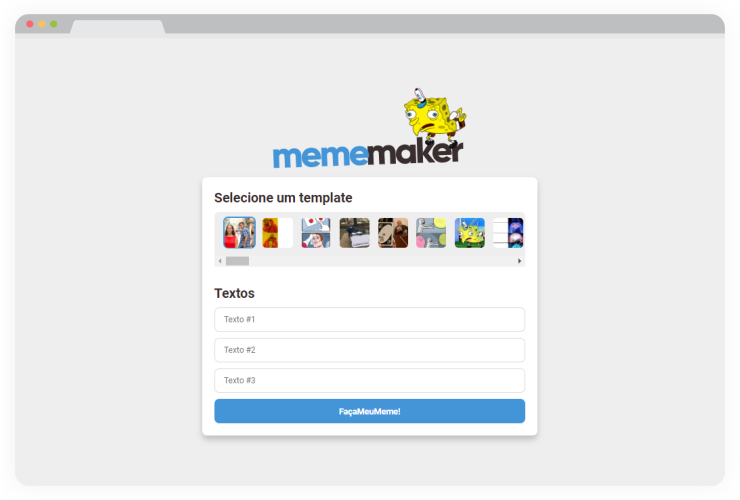

<center></center>

## Sobre
Gerador de memes desenvolvido a partir da API Restful do [imgflip](https://imgflip.com/), onde basta o usuário ecolher um template e inserir os textos desejados a serem inseridos no meme para que ele seja gerado.

## Tecnologias
Criado com:
- [x] **ReactJS** 
- [x] **Styled Components**

## Resultados
<center></center>

## Execute a aplicação
```sh
#Instale as dependências
$ npm install

#Inicie a aplicação
$ npm start
```
A aplicação vai está rodando em [http://localhost:3000](http://localhost:3000)

## License
Esse projeto está sob a licença MIT. Veja o arquivo [LICENSE](https://github.com/iranadryan/mememaker/blob/master/LICENSE) para mais detalhes.